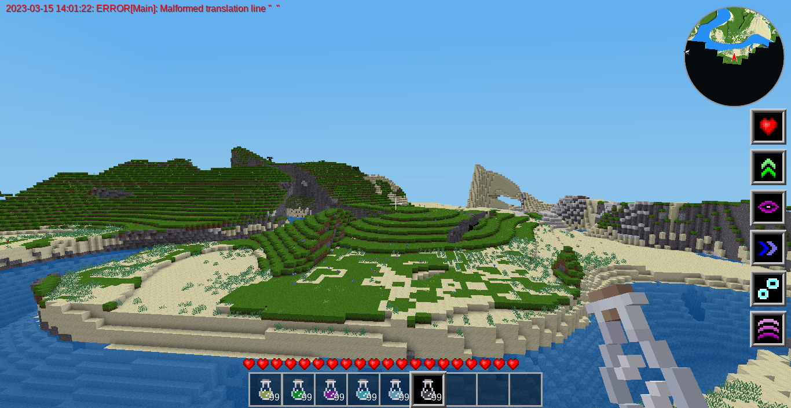
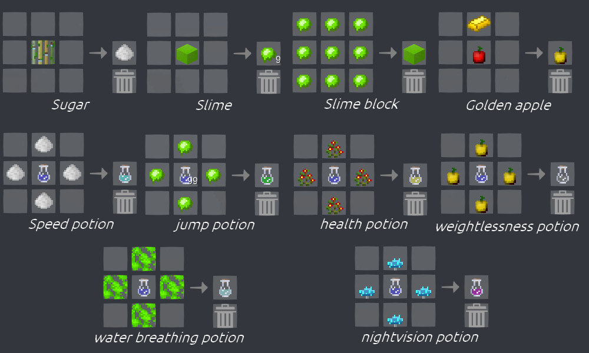
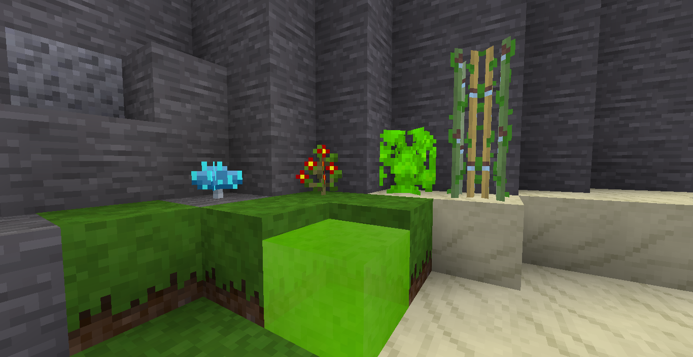
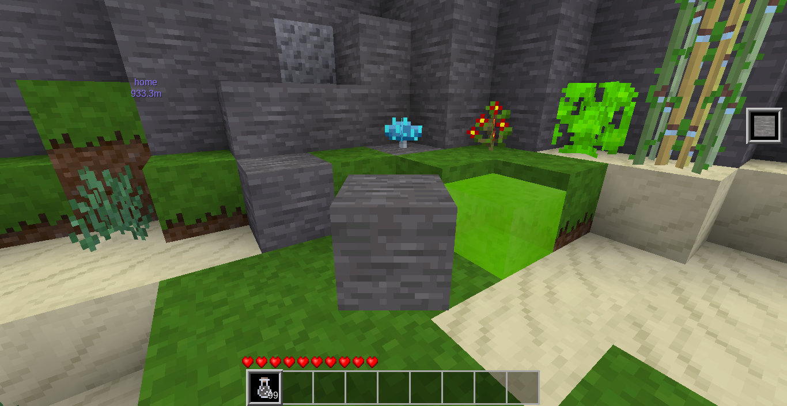
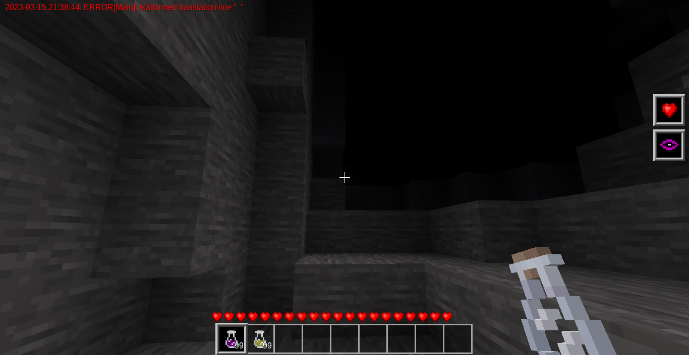

This version is a **beta** if you find **issues** please report them [on this page](https://github.com/mathyscraft/potions_and_magic/issues)
# Potions and Magic
Potions & Magic add sevral potions and items or blocks to craft them.
Effects have a player hud when they are applied.

### Effects list :
- ***health***: give 10 additionals hearts 
- ***jump***: double the jump height
- ***nightvision***: light up the night sky
- ***speed***: tripple the speed
- ***water breathing***: give the ability to breathe underwater
- ***weightlessness***: reduce by 4 the gravity

NB: All effect last **1min**

### Crafts :

New items :
- slime
- golden_apple (**reverses the gravity** for a short time)

And new blocks :
- vitality plant
- sugar cane
- slime block **(bouncy propriety)**
- gillykelp
- glow mushroom (naturally ligh the caves a bit)

---
---
### Work in progress :
- a camouflage effect

- make the nightvision effect effective in caves

- add particles